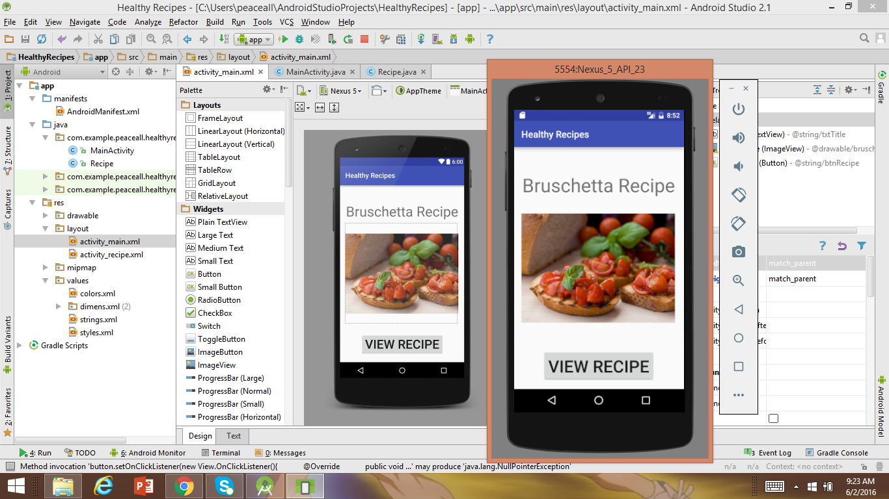
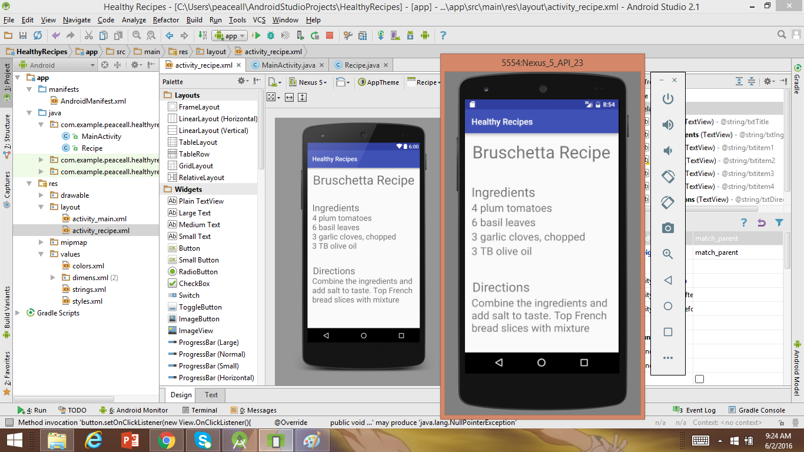

> **NOTE:** This README.md file should be placed at the **root of each of your repos directories.**
>
>Also, this file **must** use Markdown syntax, and provide project documentation as per below--otherwise, points **will** be deducted.
>

# LIS4381 - Mobile Web Application Development

## Juan Abreut

### Assignment 2 Requirements:

*Sub-Heading:*

1. To show version Control Mastery
2. Show Mobile Application Development Mastery
3. Chapter questions

#### README.md file should include the following items:

* Screenshot of Mobile Application First Screen
* Screenshot of Mobile Application Second Screen

> This is my blockquote.
> 
> This is the second paragraph in the blockquote as an example.
>
> #### Git commands w/short descriptions:

#### Assignment Screenshots:

*Screenshot of First Screen running*:

*Screenshot of Second Screen running*:

