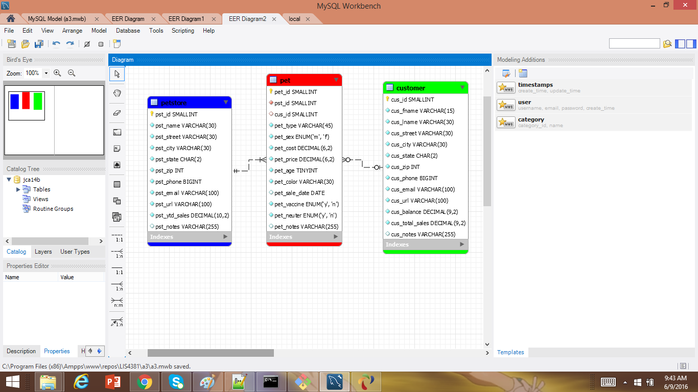

> **NOTE:** This README.md file should be placed at the **root of each of your repos directories.**
>
>Also, this file **must** use Markdown syntax, and provide project documentation as per below--otherwise, points **will** be deducted.
>

# LIS4381 - Mobile Web Application Development

## Juan Abreut

### Assignment 3 Requirements:

*Sub-Heading:*

1. To show version Mysql Mastery
2. Show local database managemnt competency
3. Chapter questions

#### README.md file should include the following items:

* Screenshot of ERD
* links to a3.sql and a3.mwb

> This is my blockquote.
> 
> This is the second paragraph in the blockquote as an example.

#### Assignment Screenshots/Links:

*Screenshot of ERD*:

*Link to a3.mwb

*Link to a3.sql

