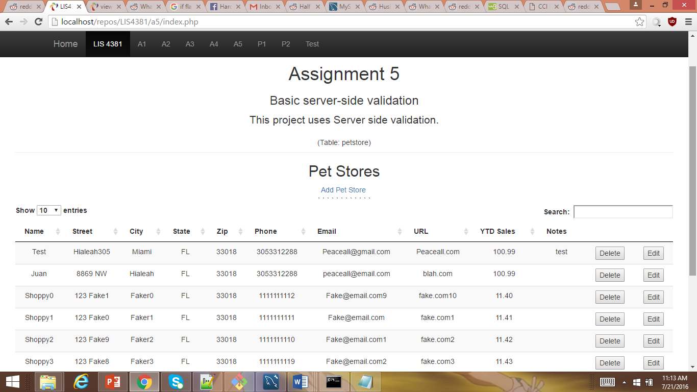
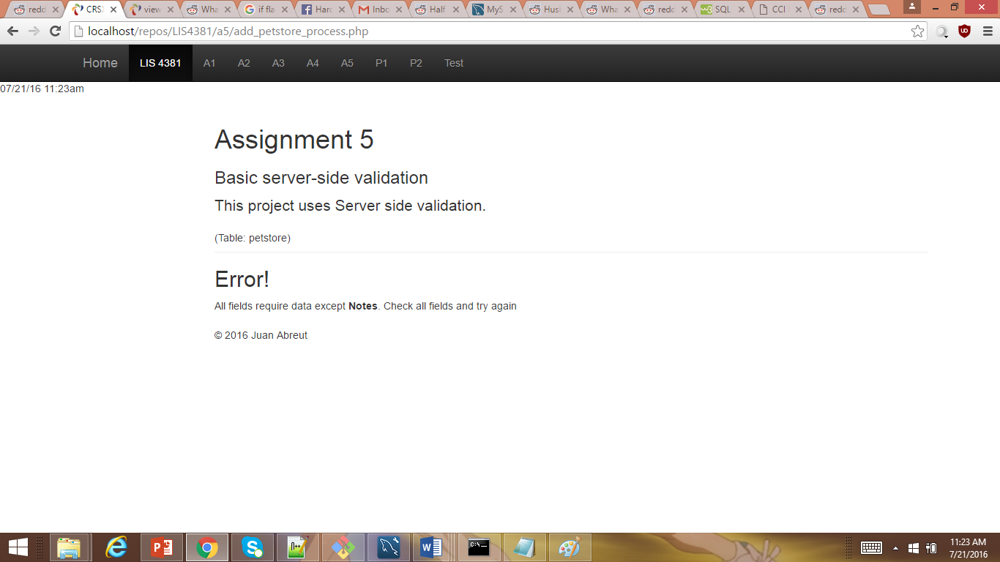

> **NOTE:** This README.md file should be placed at the **root of each of your repos directories.**
>
>Also, this file **must** use Markdown syntax, and provide project documentation as per below--otherwise, points **will** be deducted.
>

# LIS4381 - Mobile Web Application Development

## Juan Abreut

### Assignment 5 Requirements:

*Sub-Heading:*

1. Show PHP and MySQL mastery
2. Show Server Side validation mastery
3. Successfully deploy to BitBucket with localhost link

#### README.md file should include the following items:

> This is my blockquote.
> 
> This is the second paragraph in the blockquote as an example.
>
> #### Git commands w/short descriptions:

1. git init - Initializes repo
2. git status - Checks current status of repo
3. git add - Adds current changes to que for a push
4. git commit - Commits change of local repo
5. git push - Pushes changes to the server
6. git pull - pulls changes from online repo
7. git branch -lists all branches

#### Assignment Screenshots:

*First Application Screen:

*Second Screenshot:

[Local Host](http://localhost/repos/LIS4381)
