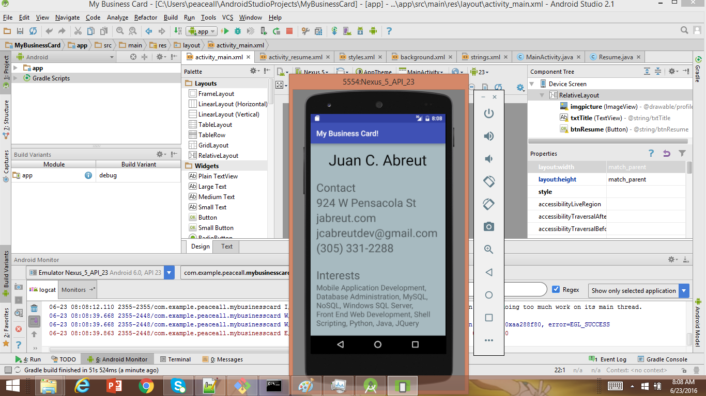

> **NOTE:** This README.md file should be placed at the **root of each of your repos directories.**
>
>Also, this file **must** use Markdown syntax, and provide project documentation as per below--otherwise, points **will** be deducted.
>

# LIS4381 - Mobile Web Application Development

## Juan Abreut

### Project 1 Requirements:

*Sub-Heading:*

1. To show Android Studio Competency
2. Show Development Exportation
3. Chapter questions

#### README.md file should include the following items:

* Create Business Card Application

* Add custom logo to application

* Implement border and text shadow 

> This is my blockquote.
> 
> This is the second paragraph in the blockquote as an example.
>
> #### Git commands w/short descriptions:

1. git init - Initializes repo
2. git status - Checks current status of repo
3. git add - Adds current changes to que for a push
4. git commit - Commits change of local repo
5. git push - Pushes changes to the server
6. git pull - pulls changes from online repo
7. git branch -lists all branches

#### Assignment Screenshots:

*First Application Screen:

*Second Application Screen:

